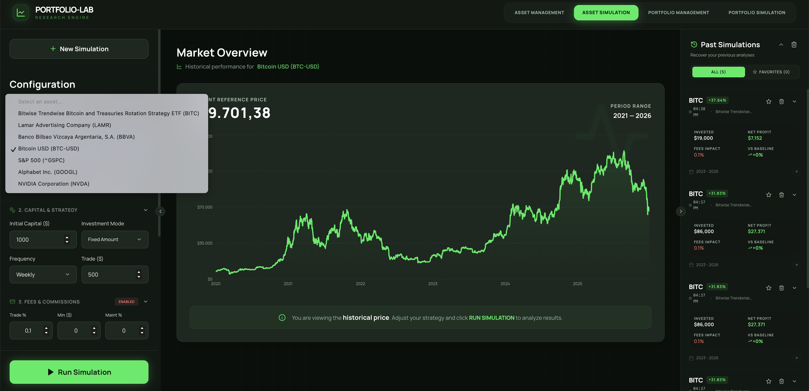
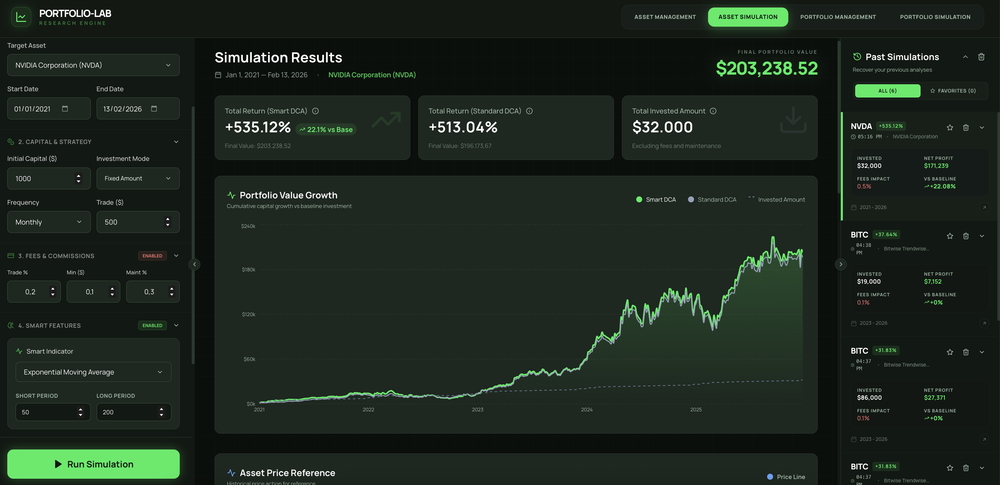
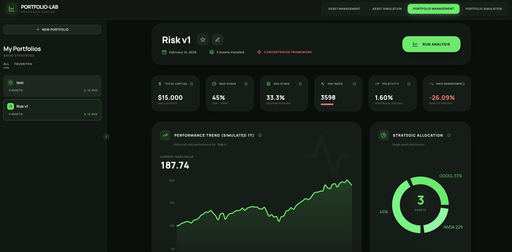
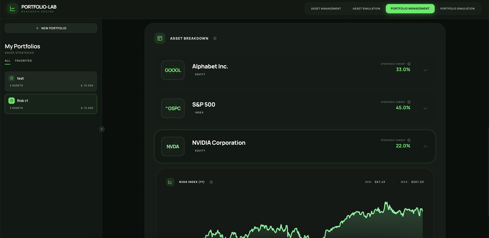
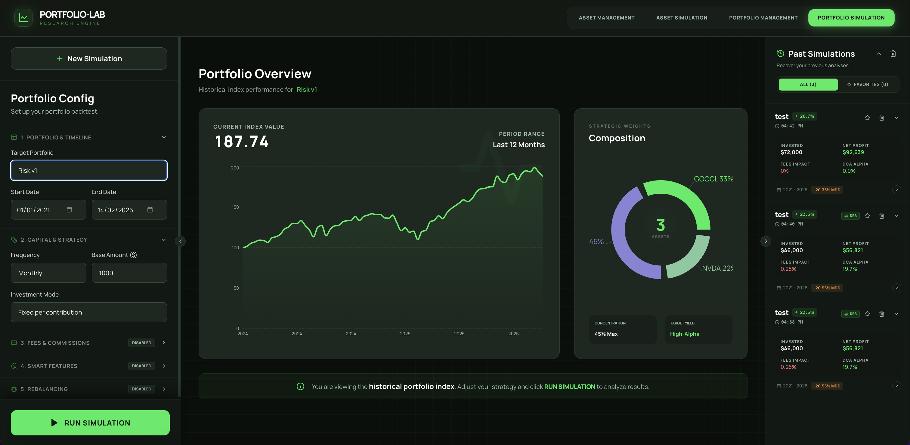
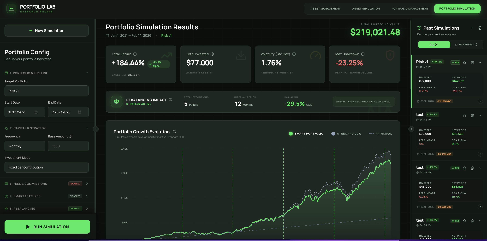
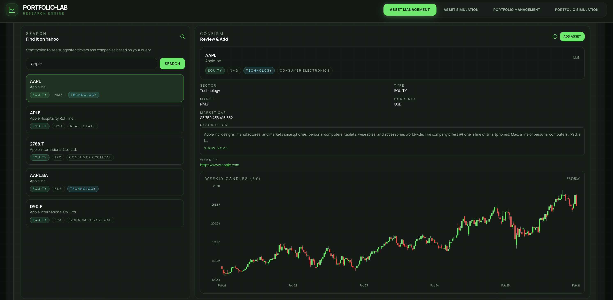
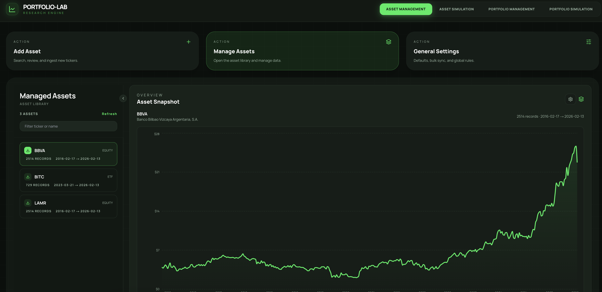

<div align="center">

# Portfolio-Lab

### Smart DCA Simulation & Backtesting Platform

*Can algorithmic adjustments to Dollar Cost Averaging beat the market?*
*Portfolio-Lab lets you find out.*

<br/>


<br/>

</div>

---

## What is Portfolio-Lab?

Portfolio-Lab is a full-stack simulation and backtesting platform that challenges the traditional "blind" Dollar Cost Averaging (DCA) strategy. It uses technical indicators (RSI, MA, EMA) to dynamically adjust **when** and **how much** you invest — then compares the results against a standard DCA baseline to measure real alpha generation.

> **The Hypothesis:** By shifting contributions towards "oversold" periods and reducing them during "overbought" conditions, a Smart DCA should outperform fixed-date, fixed-amount investing — while deploying the exact same annual capital.

---

## Quick Start

### Prerequisites

- **Docker & Docker Compose** (required)
- Python 3.13+ (optional, for local CLI)
- Node.js 20+ (optional, for local frontend dev)

### One Command Setup

```bash
# Development (with hot-reloading)
make dev-up

# Production (builds + opens browser)
make start portfolio-lab

# Stop everything
make stop
```

### Access Points

| Service | URL |
|:--------|:----|
| **Frontend** | [http://localhost:3001](http://localhost:3001) |
| **API Docs (Swagger)** | [http://localhost:8000/docs](http://localhost:8000/docs) |
| **Database** | `localhost:5433` |

---

## The Platform

Portfolio-Lab is organized into **4 main sections**, each accessible from the navigation bar.

### 1. Asset Simulation

> Single-asset DCA backtesting with Smart DCA engine.

<div align="center">




</div>

Configure and run backtests for individual assets with full control over:

- **Smart DCA Toggles** — Enable Dynamic Timing (shift buy dates) and Dynamic Sizing (adjust amounts) independently.
- **Indicator Selection** — Choose between RSI, Moving Average (MA), or Exponential MA (EMA) with configurable thresholds and periods.
- **Commission Engine** — Model real-world costs with percentage fees, minimum per trade, and annual maintenance fees.
- **6 Synchronized Charts** — Portfolio Growth, Price & Indicators, RSI sub-chart, Contributions (with time-brush), Fees Impact, and Asset Accumulation.
- **Simulation History** — Save, favorite, reload, and compare past simulations.

---

### 2. Portfolio Management

> Build and manage multi-asset portfolios.

<div align="center">




</div>

- **Portfolio Builder** — Create portfolios with any combination of assets from your library.
- **Weight Allocation** — Assign percentage weights per asset with real-time validation.
- **Position Tracking** — Track current holdings, average prices, and total value.
- **Diversification Analysis** — HHI (Herfindahl-Hirschman Index) with visual classification (Diversified / Moderate / Concentrated).
- **Quick Navigation** — Jump directly to Portfolio Simulation with one click.

---

### 3. Portfolio Simulation

> Multi-asset backtesting with rebalancing and per-asset Smart DCA.

<div align="center">




</div>

The most powerful section of the platform:

- **Per-Asset Configuration** — Each asset in the portfolio gets its own Smart DCA settings (indicator, thresholds, timing, sizing).
- **Rebalancing Engine** — Periodic rebalancing every 1-24 months, selling winners and buying laggards to maintain target allocation.
- **Portfolio Growth Chart** — Cumulative wealth comparison: Smart DCA vs Standard DCA vs Principal, with rebalancing markers.
- **Final Allocation Pie** — Visual breakdown of the portfolio at simulation end.
- **Individual Asset Deep-Dive** — Expand any asset to see its Market Price chart, RSI/MA/EMA indicator, and Contribution history.
- **Performance Optimized** — Asset sections are collapsed by default; charts render only when expanded.

---

### 4. Asset Management

> Full asset lifecycle: search, preview, ingest, and maintain.

<div align="center">




</div>

- **Yahoo Finance Search** — Search any ticker or company name. Returns up to 20 results with infinite scroll.
- **5-Year Candlestick Preview** — Custom SVG weekly candlestick chart with responsive sizing, rendered before you even add the asset.
- **One-Click Ingestion** — Add an asset and download its full history in a single action.
- **Library Management** — Browse, filter, and manage all ingested assets. View date ranges, record counts, and price previews.
- **History Downloads** — Re-download or extend history for any asset with configurable years and interval.
- **Global Settings** — Set default ingestion years (1-20) and data interval (daily, weekly, monthly).
- **Bulk Sync** — Update all assets at once with one button.

---

## Key Features

| Feature | Description |
|:--------|:------------|
| **Smart DCA Engine** | Dynamic Timing and Sizing based on RSI, MA, or EMA — zero look-ahead bias |
| **Portfolio Rebalancing** | Periodic rebalancing (1-24 months) that sells winners and buys laggards |
| **Commission Modeling** | Percentage fees, minimum per trade, and annual maintenance fees |
| **Risk Metrics** | Volatility, Max Drawdown (MDD), and Strategy Alpha |
| **Candlestick Charts** | Custom SVG 5-year weekly candles with responsive layout |
| **Performance Optimized** | Downsampled charts (200-500 pts), memoized computations, lazy rendering |
| **Simulation History** | Persistent save/load with favorites and at-a-glance metrics |
| **Interactive CLI** | Terminal-based data manager for power users |

---

## Command Palette

All operations are managed through a single `Makefile`:

```bash
make help          # Show all available commands
```

| Command | Description |
|:--------|:------------|
| `make start portfolio-lab` | Full production startup + open browser |
| `make stop` | Stop all containers (dev + prod) |
| `make dev-up` / `make dev-down` | Start / stop development environment |
| `make dev-logs` | Follow development container logs |
| `make prod-up` / `make prod-down` | Start / stop production environment |
| `make backend-cli` | Interactive data manager CLI |
| `make test-all` | Run all tests (frontend + backend) |
| `make frontend-test` | Run frontend Jest tests |
| `make backend-unit-test` | Run backend unit tests |
| `make backend-test` | Run backend integration tests |
| `make shell` | Activate Python virtual environment |

---

## Tech Stack

<table>
<tr>
<td align="center" width="150"><strong>Frontend</strong></td>
<td>Next.js 14 · TypeScript · Tailwind CSS · Recharts · Lucide Icons</td>
</tr>
<tr>
<td align="center"><strong>Backend</strong></td>
<td>Python 3.13 · FastAPI · Pydantic v2 · SQLAlchemy</td>
</tr>
<tr>
<td align="center"><strong>Database</strong></td>
<td>PostgreSQL</td>
</tr>
<tr>
<td align="center"><strong>Data</strong></td>
<td>Yahoo Finance (yfinance)</td>
</tr>
<tr>
<td align="center"><strong>Infra</strong></td>
<td>Docker · Docker Compose · Makefile</td>
</tr>
<tr>
<td align="center"><strong>Testing</strong></td>
<td>Jest + React Testing Library · pytest</td>
</tr>
</table>

---

## Project Structure

```text
.
├── backend/
│   ├── api/v1/                  # REST endpoints (4 routers)
│   ├── core/                    # Config, logging
│   ├── db/                      # SQLAlchemy session, CRUD
│   ├── models/                  # DB models (Asset, MarketData, Portfolio, ...)
│   ├── schemas/                 # Pydantic request/response schemas
│   ├── engine/                  # Simulation engines
│   │   ├── baselines/           # Standard DCA logic
│   │   ├── strategies/          # Smart DCA, Rebalancing
│   │   └── calculator.py        # ROI, Drawdown, Volatility
│   ├── services/                # Business logic layer
│   ├── data_ingestion/          # Yahoo Finance client
│   ├── cli.py                   # Interactive CLI
│   └── main.py                  # FastAPI entrypoint
├── frontend/
│   ├── src/
│   │   ├── app/                 # 4 pages + layout
│   │   │   ├── page.tsx                    # Asset Simulation
│   │   │   ├── portfolios/page.tsx         # Portfolio Management
│   │   │   ├── portfolio-analysis/page.tsx # Portfolio Simulation
│   │   │   └── assets-manager/page.tsx     # Asset Management
│   │   ├── components/          # Shared UI (Header)
│   │   ├── lib/api.ts           # API client
│   │   └── types/               # TypeScript interfaces
│   ├── public/icon.svg          # Favicon
│   └── __tests__/               # 5 test suites, 9 tests
├── tests/                       # Backend tests (unit + integration)
├── docker-compose.yml           # Production
├── docker-compose.dev.yml       # Development
├── Makefile                     # Command palette
└── CONTEXT.md                   # Full architecture docs
```

---

## Documentation

For the complete architecture, PRD, API endpoint reference, and implementation details, see **[CONTEXT.md](./CONTEXT.md)**.